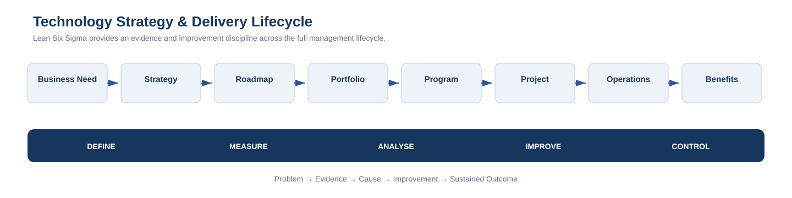
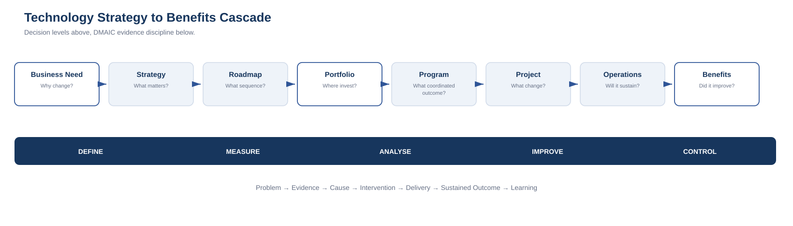

# Lean Six Sigma for Technology Strategy & Delivery

**Connecting evidence-based improvement with technology strategy, roadmaps, portfolios, programs, projects and operational outcomes.**

This repository translates Lean Six Sigma thinking into a technology-leadership context.

Its central proposition is simple:

> **A technology roadmap should not start with a list of projects. It should start with a defined problem, an evidenced current state and an understood cause.**

Lean Six Sigma does not replace technology strategy, portfolio management, program management, project delivery, Agile, architecture or service management. It strengthens the evidence and decision discipline that runs across all of them.

---

## The master model

The technology-management lifecycle is represented as:

**Business Need → Strategy → Roadmap → Portfolio → Program → Project → Operations → Benefits**

Lean Six Sigma runs horizontally across that lifecycle:

**Define → Measure → Analyse → Improve → Control**

This creates a practical bridge between improvement disciplines and technology planning/delivery.

---

## The questions change by management level

| Management level | Primary question |
|---|---|
| **Strategy** | What problem, opportunity or capability gap are we trying to address? |
| **Roadmap** | What sequence of capabilities and investments moves us from current state to target state? |
| **Portfolio** | Are we investing in the right things, in the right order, within available capacity? |
| **Program** | Are coordinated changes producing the intended business outcome? |
| **Project** | Are we delivering a defined change effectively and safely? |
| **Operations** | Is the improvement stable, supportable and sustained? |
| **Benefits** | Did the investment actually improve the outcome that justified it? |

DMAIC provides a consistent reasoning pattern across all seven levels.

---

## Framework contents

The repository now provides a consolidated Lean Six Sigma reference spanning technology strategy, roadmaps, portfolios, programs, projects, operations and benefits realisation.

### Core documentation

1. [Framework Overview](docs/01-framework-overview.md)
2. [Master Technology Lifecycle](docs/02-master-technology-lifecycle.md)
3. [DMAIC × Technology Management Crosswalk](docs/03-dmaic-technology-management-crosswalk.md)
4. [Problem-to-Roadmap Model](docs/04-problem-to-roadmap.md)
5. [Worked Example: Technology Estate Rationalisation](docs/05-worked-example-technology-estate-rationalisation.md)
6. [Phase 2 Expansion Roadmap](docs/06-phase2-expansion-roadmap.md)
7. [Publishing & Derivative Content Plan](docs/07-publishing-derivatives.md)
8. [Lean Waste in Technology](docs/08-lean-waste-in-technology.md)
9. [DMAIC vs DMADV in Technology](docs/09-dmaic-vs-dmadv.md)
10. [DMAIC and Agile / Iterative Delivery](docs/10-dmaic-agile-iterative-delivery.md)
11. [Six Sigma / Lean Tool Crosswalk for Technology](docs/11-technology-tool-crosswalk.md)
12. [Portfolio Prioritisation](docs/12-portfolio-prioritisation.md)
13. [Program Benefits Mapping](docs/13-program-benefits-mapping.md)
14. [Benefits Realisation & Control Loop](docs/14-benefits-realisation-loop.md)
15. [Worked Example: Service Desk Flow Improvement](docs/15-worked-example-service-desk.md)

### Diagrams

- [Master Lifecycle](diagrams/master-lifecycle.svg)
- [DMAIC × Management Levels](diagrams/dmaic-management-levels.svg)
- [Problem to Roadmap](diagrams/problem-to-roadmap.svg)
- [Technology Estate Rationalisation Example](diagrams/technology-estate-rationalisation.svg)
- [Lean Waste in Technology](diagrams/lean-waste-in-technology.svg)
- [DMAIC vs DMADV](diagrams/dmaic-vs-dmadv.svg)
- [DMAIC + Agile / Iterative Delivery](diagrams/dmaic-agile-overlay.svg)
- [Technology Tool Crosswalk](diagrams/technology-tool-crosswalk.svg)
- [Portfolio Prioritisation](diagrams/portfolio-prioritisation.svg)
- [Program Benefits Map](diagrams/program-benefits-map.svg)
- [Benefits Realisation Loop](diagrams/benefits-realisation-loop.svg)
- [Strategy to Benefits Cascade](diagrams/strategy-to-benefits-cascade.svg)

Editable Mermaid-style source files are also included under [`diagrams/source/`](diagrams/source/).

### Templates

- [Technology Problem Charter](templates/01-technology-problem-charter.md)
- [Current-State Baseline](templates/02-current-state-baseline.md)
- [Capability Gap Analysis](templates/03-capability-gap-analysis.md)
- [Roadmap Prioritisation](templates/04-roadmap-prioritisation.md)
- [Benefits & Control Plan](templates/05-benefits-control-plan.md)
- [Portfolio Evaluation](templates/06-portfolio-evaluation.md)
- [Program Benefits Map](templates/07-program-benefits-map.md)
- [Benefits Realisation Register](templates/08-benefits-realisation-register.md)
- [Tool Selection Guide](templates/09-tool-selection-guide.md)

---

## DMAIC is not a project lifecycle replacement

The overlap is significant, but the disciplines solve different problems.

A project methodology typically helps answer:

- How will we organise and deliver the work?
- What scope, schedule, budget and governance are required?
- How will risks, dependencies and stakeholders be managed?

DMAIC asks:

- What problem are we solving?
- How do we know it exists?
- What is causing it?
- Which intervention is likely to improve it?
- How will we prove and sustain the improvement?

These questions can sit **above, beside and inside** project delivery.

A project can be on time and on budget while failing to improve the problem that justified it. DMAIC helps maintain the connection between activity and outcome.

---

## The strategy-to-delivery connection

A useful planning sequence is:

**Problem → Current State → Evidence → Root Cause → Capability Gap → Options → Prioritisation → Roadmap → Delivery → Benefits**

This differs from a project-list-driven roadmap:

**Requests → Projects → Budget → Delivery**

The latter can produce a busy portfolio without a clear evidence chain between investment and business outcome.

---

## How to use the framework

The repository is intended to support several use cases:

### Strategic roadmap development
Use DMAIC to establish the problem, baseline the current state, analyse capability gaps and create a sequenced roadmap.

### Portfolio planning
Use evidence, prioritisation criteria, risk, capacity and benefits to decide where limited investment should go.

### Program design
Connect multiple projects to one measurable outcome rather than treating project completion as the definition of program success.

### Project initiation
Strengthen the charter, baseline, problem statement, root-cause analysis and benefit measures before solution delivery dominates the conversation.

### Operational improvement
Apply Lean and Six Sigma tools to incidents, service performance, manual work, process delays, technical debt, cost and reliability.

### Benefits realisation
Compare post-delivery outcomes with the original baseline and feed results back into strategy and portfolio decisions.

---

## Worked example

The Phase 1 worked example uses a **fragmented technology estate**.

The scenario is intentionally illustrative rather than organisation-specific.

It follows the full chain:

**High cost / complexity → baseline → root causes → capability gaps → rationalisation options → roadmap → delivery waves → operating controls → benefits**

See [Worked Example: Technology Estate Rationalisation](docs/05-worked-example-technology-estate-rationalisation.md).

---

## v1.0.0 — Stable Reference

v1.0.0 consolidates the framework into a complete reference spanning strategy, roadmaps, portfolio prioritisation, program outcomes, project/Agile delivery, operational improvement, Lean waste, DMAIC/DMADV, tool selection and benefits realisation.

It also includes a static [Technology Roadmap Evidence Check](tools/technology-roadmap-evidence-check/).

See [Framework Evolution](docs/06-phase2-expansion-roadmap.md).

---

## Publishing model

This repository is the **canonical source**.

Derivative material should be adapted to the platform rather than copied verbatim:

- **DEV** — practical application and technical delivery
- **Hashnode** — architecture, roadmaps and strategy-to-delivery thinking
- **Hugging Face** — interactive readiness/decision tools
- **Professional website** — curated executive-facing summary
- **GitHub** — canonical framework, diagrams, templates and version history

See [Publishing & Derivative Content Plan](docs/07-publishing-derivatives.md).

---

## Repository principles

1. **Problem before project.**
2. **Evidence before solution.**
3. **Cause before investment.**
4. **Capability before product.**
5. **Outcome before activity.**
6. **Control after delivery.**
7. **Benefits feed the next strategy cycle.**

---

## Release

Current release: **v1.0.0 — Stable Reference**

See [v1.0.0 release notes](release-notes/v1.0.0.md).

Previous releases:
- [v0.2.0 — Lean, Design & Iterative Delivery](release-notes/v0.2.0.md)
- [v0.1.0 — Foundation](release-notes/v0.1.0.md)

---

## Licensing

This repository uses a split licensing model:

- **Documentation, diagrams and templates:** Creative Commons Attribution 4.0 International (CC BY 4.0)
- **Executable code or scripts added in future:** MIT License

See [LICENSE.md](LICENSE.md) for details.

---

## Author

**Rakesh Randeria**  
Technology Executive — Strategy, Transformation, Cybersecurity, AI & Digital Enablement

Professional site: https://rakeshranderia.com.au/  
GitHub: https://github.com/rakeshranderia
