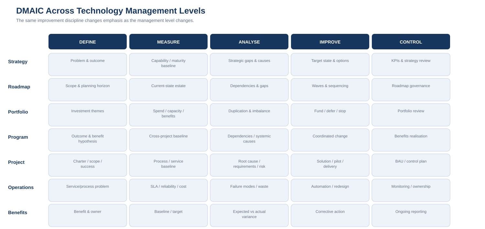

# 3. DMAIC × Technology Management Crosswalk

This crosswalk is the core reference model for the repository.

## Summary matrix

| Level | Define | Measure | Analyse | Improve | Control |
|---|---|---|---|---|---|
| **Strategy** | Business problem, opportunity, strategic outcome | Capability, maturity, cost, risk baseline | Strategic gaps, constraints, systemic causes | Target state, principles, strategic options | Strategy KPIs, review cadence |
| **Roadmap** | Scope and outcome of change horizon | Current-state estate/capabilities | Dependencies, gaps, sequencing constraints | Roadmap waves, target capabilities | Roadmap governance and refresh |
| **Portfolio** | Investment themes and selection criteria | Spend, capacity, performance, benefits baseline | Duplication, concentration, value/risk imbalance | Fund, defer, stop, rebalance | Portfolio reviews, benefits and capacity |
| **Program** | Program outcome and benefit hypothesis | Cross-project baseline and dependency measures | Root causes spanning projects/process/people/data | Coordinated change design | Benefits realisation and operating model |
| **Project** | Charter, scope, stakeholders, success criteria | Process/service baseline | Root cause, requirements, risk, dependencies | Solution, pilot, implementation | BAU handover, acceptance, control plan |
| **Operations** | Service/process problem | SLA, reliability, cost, incident and quality data | Failure modes, waste, recurring causes | Automation, redesign, standardisation | Monitoring, SOPs, ownership, continuous improvement |
| **Benefits** | Intended benefit and owner | Baseline and target | Variance between expected and realised benefit | Corrective action / further improvement | Ongoing reporting and strategic feedback |

---

# DEFINE

Define creates clarity before activity.

## Strategy
Typical questions:

- What business outcome matters?
- What is changing externally or internally?
- What strategic constraint exists?
- What capability is missing?
- Who owns the outcome?

Typical artefacts:

- strategic problem statement;
- outcome statement;
- stakeholder map;
- Voice of Customer / stakeholder input;
- Critical-to-Quality or Critical-to-Outcome measures;
- strategic charter.

## Roadmap
Typical questions:

- What horizon does the roadmap cover?
- What part of the technology estate is in scope?
- What target state is being pursued?
- What principles constrain the roadmap?

Typical artefacts:

- roadmap charter;
- target-state principles;
- capability domains;
- planning assumptions.

## Portfolio
Typical questions:

- What kinds of investment will be considered?
- What selection criteria apply?
- What strategic themes must investment support?

Typical artefacts:

- investment themes;
- prioritisation criteria;
- risk appetite;
- funding guardrails.

## Program
Typical questions:

- What outcome requires coordinated change?
- Which benefits cannot be achieved through one project?
- What dependencies exist?

Typical artefacts:

- program charter;
- benefit hypothesis;
- outcome measures;
- high-level dependency map.

## Project
Typical questions:

- What exact change is being delivered?
- What is in/out of scope?
- Who are the users/stakeholders?
- What does acceptance mean?

Typical artefacts:

- project charter;
- scope;
- stakeholder map;
- acceptance criteria.

## Operations
Typical questions:

- What operational problem is occurring?
- Where is the service/process boundary?
- Who owns it?

Typical artefacts:

- service problem statement;
- incident/problem record;
- process boundary;
- service owner.

---

# MEASURE

Measure creates an evidenced current state.

## Strategy measures may include
- technology run cost;
- application count;
- cyber maturity;
- service availability;
- technical debt;
- workforce capability;
- data maturity;
- customer satisfaction;
- platform utilisation.

## Roadmap measures may include
- estate inventory;
- lifecycle state;
- end-of-support exposure;
- integration complexity;
- platform overlap;
- capacity;
- dependency maturity.

## Portfolio measures may include
- total committed spend;
- discretionary vs mandatory investment;
- resource demand;
- forecast vs actual;
- benefit delivery;
- initiative age;
- work in progress.

## Program measures may include
- baseline process performance;
- cross-project dependency status;
- change readiness;
- benefit baseline;
- adoption.

## Project measures may include
- cycle time;
- defects;
- service levels;
- user effort;
- transaction volume;
- error rate;
- cost per transaction.

## Operations measures may include
- incident volume;
- MTTR;
- change failure rate;
- availability;
- queue time;
- backlog;
- first-contact resolution;
- automation rate.

---

# ANALYSE

Analyse is the point at which the framework should resist premature solution selection.

Questions include:

- What is actually causing the current state?
- Which causes are systemic?
- Which symptoms are being mistaken for causes?
- Which small number of issues create most of the impact?
- Which dependencies prevent change?
- What would happen if nothing changed?

Tools may include:

- 5 Whys;
- fishbone / cause-and-effect analysis;
- Pareto;
- process mapping;
- value-stream mapping;
- FMEA;
- dependency mapping;
- capability-gap analysis;
- data analysis;
- cost-of-poor-quality analysis.

At strategy/portfolio level, “root cause” is often broader than a single process defect.

Examples:

- fragmented ownership;
- historical acquisitions;
- inconsistent architecture;
- underinvestment;
- weak lifecycle management;
- misaligned incentives;
- duplicated vendor capability;
- poor data governance;
- unclear decision rights.

---

# IMPROVE

Improve is where strategy becomes intervention.

Possible technology improvements include:

- redesigning a process;
- automating manual work;
- consolidating platforms;
- rationalising applications;
- introducing a new capability;
- changing an operating model;
- migrating infrastructure;
- improving integration;
- changing vendor arrangements;
- strengthening security controls;
- redesigning data flows.

At roadmap level, Improve includes **sequencing**.

At portfolio level, Improve includes **funding choices**.

At program level, Improve includes **coordination across projects**.

At project level, Improve includes **design and implementation**.

At operations level, Improve includes **continuous improvement and standardisation**.

---

# CONTROL

Control ensures the improvement does not disappear after go-live.

Control can include:

- named service ownership;
- KPI dashboards;
- architecture standards;
- security monitoring;
- licence/utilisation reviews;
- vendor scorecards;
- benefits tracking;
- automated validation;
- standard operating procedures;
- lifecycle review;
- quarterly portfolio review;
- post-implementation review;
- control plans.

The key test is:

> **What mechanism will detect if the organisation starts drifting back toward the original problem?**

---

# The overlap with project and delivery methodologies

The crosswalk does not imply that DMAIC and a project lifecycle are identical.

A typical delivery lifecycle might be:

**Initiate → Plan → Design → Build → Test → Deploy → Transition → Close**

DMAIC might sit around it:

**Define → Measure → Analyse → [delivery lifecycle inside Improve] → Control**

Alternatively, individual DMAIC loops can occur inside a larger program.

This is why the framework is complementary rather than competitive.
