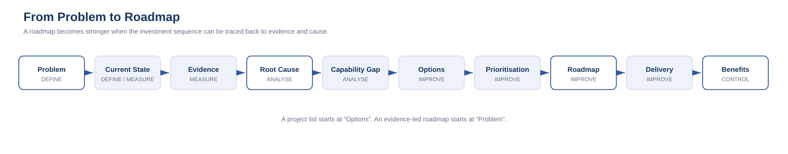

# 4. Problem-to-Roadmap Model

A strategic technology roadmap should represent a reasoned path from problem to outcome.

The core sequence is:

**Problem → Current State → Evidence → Root Cause → Capability Gap → Options → Prioritisation → Roadmap → Delivery → Benefits**

---

## 1. Problem

Start with the business or technology condition that needs to improve.

Strong:

> Service instability and fragmented platform ownership are limiting growth and increasing operational risk.

Weak:

> Replace Platform X.

The weak version assumes the answer before the problem is established.

---

## 2. Current State

Describe what exists today.

This can include:

- systems;
- vendors;
- architecture;
- service model;
- operating model;
- skills;
- cost;
- lifecycle state;
- data;
- process;
- governance.

The current state should be sufficient to explain the environment, not an attempt to document everything.

---

## 3. Evidence

Establish measurable evidence.

Examples:

- run cost;
- incident volume;
- support effort;
- licence utilisation;
- integration count;
- cycle time;
- rework;
- end-of-support exposure;
- duplicated capability;
- manual effort;
- risk exceptions.

Evidence creates a baseline.

Without a baseline, benefit claims become difficult to prove later.

---

## 4. Root Cause

Analyse why the problem exists.

This is where many roadmaps skip ahead.

Possible causes include:

- historic acquisitions;
- tactical decisions that became permanent;
- missing architecture standards;
- fragmented budgets;
- weak product/service ownership;
- data quality;
- manual hand-offs;
- vendor lock-in;
- poor lifecycle governance;
- underinvestment.

A root cause should be actionable enough to influence the target state.

---

## 5. Capability Gap

Translate causes into capabilities that need to exist or improve.

Example:

Problem:
> Duplicate platforms and inconsistent customer data.

Root causes:
- decentralised procurement;
- no authoritative customer identity;
- inconsistent integration standards.

Capability gaps:
- portfolio governance;
- master/customer identity;
- integration architecture;
- service ownership.

This prevents the roadmap from becoming a product catalogue.

---

## 6. Options

Generate more than one response where appropriate.

Options might include:

- optimise existing platform;
- consolidate;
- replace;
- integrate;
- standardise;
- outsource;
- insource;
- automate;
- retire;
- redesign the process.

Each option should be assessed against:

- outcome fit;
- strategic fit;
- cost;
- risk;
- time;
- dependency;
- reversibility;
- operational impact.

---

## 7. Prioritisation

Prioritisation should expose trade-offs.

A simple model might score:

- strategic alignment;
- business value;
- risk reduction;
- customer impact;
- regulatory need;
- dependency enablement;
- effort;
- cost;
- organisational capacity.

The score should inform judgement, not replace it.

---

## 8. Roadmap

The roadmap sequences changes.

Useful roadmap waves may include:

### Stabilise
Address urgent reliability, security or lifecycle risks.

### Simplify
Reduce duplication, remove obsolete components and clarify ownership.

### Modernise
Introduce target platforms, architecture and operating practices.

### Optimise
Automate, improve experience and increase value from the target state.

Not every roadmap needs these exact labels, but the idea of **purposeful waves** is useful.

---

## 9. Delivery

Roadmap initiatives become:

- portfolio items;
- programs;
- projects;
- operational changes.

Delivery methodology can vary.

Agile, waterfall, hybrid, product-based and vendor-led delivery can all sit under the roadmap.

---

## 10. Benefits

Benefits should reconnect to the original problem.

If the original problem was high technology run cost, measure cost.

If the problem was slow onboarding, measure onboarding.

If the problem was service instability, measure service stability.

The final question is:

> **Did the roadmap improve the condition that justified the investment?**

---

## Relationship to DMAIC

| Problem-to-Roadmap step | DMAIC alignment |
|---|---|
| Problem | Define |
| Current State | Define / Measure |
| Evidence | Measure |
| Root Cause | Analyse |
| Capability Gap | Analyse |
| Options | Improve |
| Prioritisation | Improve |
| Roadmap | Improve |
| Delivery | Improve |
| Benefits | Control |

This is not a rigid mapping, but it demonstrates the overlap clearly.
