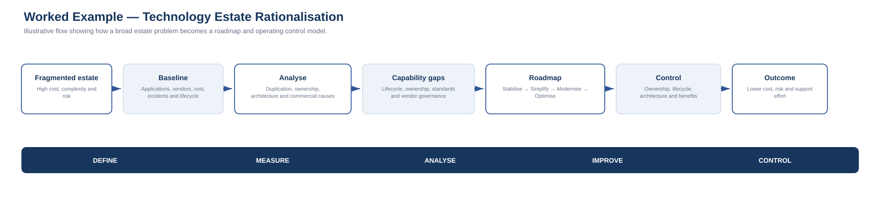

# 5. Worked Example: Technology Estate Rationalisation

> **Note:** This is an illustrative scenario. The figures are fictional and are included to demonstrate the framework.

## Scenario

A mid-sized organisation has grown through acquisitions and local business-unit decisions.

Technology leadership observes:

- high run cost;
- duplicated applications;
- inconsistent support;
- overlapping vendors;
- complex integrations;
- weak lifecycle visibility;
- growing security exceptions;
- user frustration.

The instinctive response might be:

> “We need an application rationalisation project.”

The framework starts one level earlier.

---

# DEFINE

## Problem statement

> The technology estate has become fragmented and expensive to operate. Duplicate capabilities, inconsistent standards and weak ownership increase support effort, security risk and change complexity.

## Desired outcomes

- lower run cost;
- reduced duplication;
- clearer ownership;
- improved supportability;
- lower security/lifecycle exposure;
- simpler integration;
- more capacity for strategic change.

## Scope

In scope:

- business applications;
- infrastructure/platform services;
- major technology vendors;
- key integrations;
- licensing;
- service ownership.

Out of scope for Phase 1:

- detailed process redesign;
- all end-user productivity tooling;
- low-cost specialist applications below an agreed threshold.

## Stakeholders

- executive sponsor;
- technology;
- finance;
- procurement;
- security;
- application owners;
- business-unit leaders;
- data owners.

---

# MEASURE

A baseline is established.

Illustrative data:

| Measure | Baseline |
|---|---:|
| Applications in inventory | 82 |
| Material technology vendors | 26 |
| Applications with duplicate capability | 21 |
| Applications without named business owner | 17 |
| Applications within 24 months of end-of-support | 13 |
| Annual licence/support spend | $4.8m |
| Average licence utilisation across top SaaS tools | 68% |
| Major point-to-point integrations | 47 |
| P1/P2 incidents linked to legacy platforms (12 months) | 31 |
| Annual contractor/support effort linked to legacy estate | 8.2 FTE equivalent |

The numbers are not the conclusion.

They establish where analysis should focus.

---

# ANALYSE

## Pareto-style focus

Analysis finds that:

- 14 applications account for 61% of support effort;
- 7 vendors account for 58% of annual application spend;
- 9 applications account for most lifecycle/security exceptions;
- duplicate CRM, document-management and analytics capabilities represent a large share of avoidable cost.

## Root causes

A cause-and-effect review identifies:

### Governance
- decentralised procurement;
- weak retirement gates;
- no consistent application ownership standard.

### Architecture
- tactical point-to-point integration;
- local platform choices;
- inconsistent target-state standards.

### Commercial
- contracts negotiated independently;
- duplicate capabilities procured by separate teams;
- weak utilisation review.

### Delivery
- project success measured at go-live;
- decommissioning treated as optional follow-up;
- legacy systems retained “temporarily”.

### Data
- migration risk;
- unclear data ownership;
- duplicated customer/product structures.

The important conclusion is:

> The estate problem is not simply “too many applications”. It is the result of weak lifecycle, ownership, architecture and commercial controls.

That conclusion changes the roadmap.

---

# CAPABILITY GAPS

The organisation identifies several gaps:

1. **Application lifecycle governance**
2. **Business/service ownership**
3. **Architecture standards**
4. **Vendor and licence governance**
5. **Integration standards**
6. **Data ownership and migration capability**
7. **Benefits/decommissioning accountability**

These capabilities are broader than any one rationalisation project.

---

# IMPROVE — OPTIONS

Potential interventions include:

## Option A — Cost-only licence reduction
Benefits:
- fast;
- low disruption.

Limitations:
- does not address architecture or ownership;
- duplication likely to return.

## Option B — Application rationalisation program
Benefits:
- removes duplication;
- can reduce cost and risk.

Limitations:
- may fail if lifecycle and procurement controls stay unchanged.

## Option C — Rationalisation + operating-control uplift
Includes:
- application disposition;
- vendor consolidation;
- ownership standard;
- architecture principles;
- retirement gate;
- annual utilisation review;
- benefits tracking.

This option addresses both symptoms and root causes.

---

# PRIORITISATION

Each application is assessed using criteria such as:

- strategic fit;
- business criticality;
- duplication;
- lifecycle risk;
- security risk;
- annual cost;
- utilisation;
- integration complexity;
- migration complexity;
- data complexity.

Disposition:

- **Invest**
- **Retain**
- **Consolidate**
- **Replace**
- **Retire**
- **Investigate**

---

# ROADMAP

## Wave 1 — Stabilise
0–3 months

- confirm ownership;
- address critical end-of-support exposure;
- freeze non-essential spend on duplicate tools;
- baseline contracts and licences;
- identify quick licence reductions.

## Wave 2 — Simplify
3–9 months

- consolidate duplicate SaaS capabilities;
- retire low-dependency applications;
- renegotiate/vendor consolidate;
- introduce application lifecycle governance;
- establish architecture review.

## Wave 3 — Modernise
6–18 months

- migrate strategic legacy platforms;
- redesign key integrations;
- strengthen data ownership;
- establish target shared platforms.

## Wave 4 — Optimise
12–24 months

- automate lifecycle reporting;
- improve utilisation analytics;
- reduce manual support;
- continuously review portfolio value.

The roadmap contains both **delivery initiatives** and **control improvements**.

That is important.

Without the control improvements, the organisation may recreate the same estate complexity later.

---

# PROGRAM / PROJECT STRUCTURE

The roadmap may become a portfolio containing:

### Program 1 — Application Rationalisation
Projects:
- CRM consolidation;
- document-management consolidation;
- analytics simplification;
- legacy application retirement.

### Program 2 — Platform Modernisation
Projects:
- integration uplift;
- identity standardisation;
- infrastructure/platform migration.

### Operational Improvement
- licence review;
- ownership register;
- lifecycle dashboard;
- architecture governance.

The outcome is larger than any one project.

---

# CONTROL

The control plan includes:

| Control | Owner | Frequency | Trigger |
|---|---|---|---|
| Application ownership review | Technology governance | Quarterly | Missing/disabled owner |
| Licence utilisation review | Commercial / IT | Quarterly | <70% utilisation |
| Application lifecycle review | Architecture | Quarterly | EOL within 24 months |
| New platform review | Architecture / Portfolio | Per request | New capability/vendor |
| Benefits review | Portfolio governance | Quarterly | Variance to business case |
| Vendor concentration review | Commercial / Risk | Six-monthly | Threshold exceeded |

---

# BENEFITS

After 12 months, the organisation compares actual outcomes with the baseline.

Illustrative target outcomes:

- application count reduced by 15–20%;
- material vendor count reduced;
- duplicated capability materially reduced;
- named ownership above 95%;
- end-of-support exposure reduced;
- support effort reduced;
- licence utilisation improved;
- annual run cost reduced.

The exact benefit is less important than the evidence chain.

The organisation should be able to explain:

**Problem → Baseline → Cause → Intervention → Roadmap → Delivery → Measured Outcome**

That is the purpose of applying the Lean Six Sigma lens.
