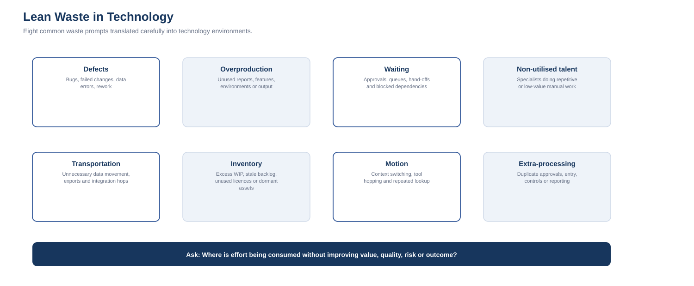

# 8. Lean Waste in Technology

Lean is often described through the elimination of waste: activity that consumes time, money or capacity without contributing proportionate value to the customer or outcome.

Technology environments are not factories, and the analogy should not be forced.

However, the underlying question translates well:

> **Where is effort being consumed without improving the outcome?**

A common eight-waste extension is represented by **DOWNTIME**:

- Defects
- Overproduction
- Waiting
- Non-utilised talent
- Transportation
- Inventory
- Motion
- Extra-processing

The categories are useful prompts, not rigid classifications.

---

## 1. Defects

In technology, defects can include:

- software bugs;
- failed changes;
- incorrect configuration;
- data-quality errors;
- security misconfiguration;
- integration failures;
- incomplete requirements;
- incidents caused by preventable implementation errors.

The waste is not only the defect itself. It includes investigation, rework, retesting, rollback, user disruption, support effort and opportunity cost.

### Useful measures
- change failure rate;
- escaped defect rate;
- rework effort;
- incident recurrence;
- error rate;
- failed transaction rate.

### Improvement questions
- Where are defects introduced?
- Where are they detected?
- How far do they travel before detection?
- Can validation or automation detect them earlier?
- Are recurring defects being treated as individual incidents rather than systemic causes?

---

## 2. Overproduction

Overproduction means producing more, earlier or more often than is needed.

Technology examples can include:

- reports nobody uses;
- features delivered before there is a validated need;
- excessive environments;
- duplicated dashboards;
- automated notifications that create noise;
- infrastructure provisioned far ahead of demand;
- multiple teams producing similar artefacts.

### Useful measures
- feature adoption;
- report usage;
- environment utilisation;
- dashboard usage;
- notification engagement;
- unused capability.

### Improvement questions
- Who consumes this output?
- What decision does it support?
- What would happen if we stopped producing it?
- Is the output used often enough to justify the maintenance effort?

---

## 3. Waiting

Waiting is one of the most recognisable forms of technology waste.

Examples:

- approval queues;
- tickets waiting for assignment;
- access requests waiting for authorisation;
- projects waiting for architecture decisions;
- teams waiting for environments;
- vendor dependencies;
- hand-offs between support tiers;
- change windows;
- data extracts waiting for another team.

### Useful measures
- queue time;
- lead time;
- touch time vs elapsed time;
- approval time;
- blocked work;
- ageing backlog.

### Improvement questions
- How much elapsed time is active work?
- Which queues dominate cycle time?
- Can approval thresholds be made risk-based?
- Can ownership and decision rights be clarified?
- Can self-service or automation remove avoidable waiting?

---

## 4. Non-utilised talent

Technology teams can waste specialist capability when highly skilled people spend significant time on repetitive or low-value work.

Examples:

- engineers manually compiling routine reports;
- senior specialists repeatedly performing basic administration;
- security staff chasing evidence manually;
- project managers reconstructing status from disconnected systems;
- analysts reformatting data rather than analysing it.

This category should not be interpreted as maximising individual utilisation.

The issue is whether capability is being applied where it creates the most value.

---

## 5. Transportation

In physical Lean, transportation refers to unnecessary movement of materials.

In technology, a careful analogue is unnecessary movement of information or data.

Examples:

- repeated file exports/imports;
- unnecessary integration hops;
- batch transfers between systems that could share a service;
- copying data into spreadsheets for re-upload;
- duplicate data stores created only to bridge process gaps;
- manual movement of evidence between tools.

Data movement is not inherently wasteful. It becomes a concern when movement adds cost, delay, risk or failure points without adding value.

---

## 6. Inventory

Inventory in technology needs careful interpretation.

Useful analogues include:

- excessive work in progress;
- large undifferentiated backlogs;
- unused hardware;
- unused software licences;
- dormant applications;
- queued changes;
- unresolved work that continues to consume attention.

Technical debt can contribute to this category, but it is broader than inventory and should not automatically be treated as the same thing.

---

## 7. Motion

Motion concerns unnecessary movement by people.

In technology, examples may include:

- excessive switching between tools;
- repeated navigation to find information;
- manual lookup across multiple systems;
- moving between channels to reconstruct context;
- repeated authentication or environment switching;
- fragmented documentation.

This category is closely related to user and employee experience.

---

## 8. Extra-processing

Extra-processing means performing more work than the outcome requires.

Technology examples include:

- duplicate approvals;
- duplicate data entry;
- repeated reconciliation;
- redundant reporting;
- excessive documentation with no decision purpose;
- manual controls that duplicate automated controls;
- multiple governance forums reviewing the same decision;
- unnecessary customisation.

The important word is **unnecessary**.

A control is not waste merely because it adds a step. The question is whether the step creates value proportionate to its cost and risk reduction.

---

# Lean waste at different technology levels

The same waste pattern can exist from strategy to operations.

## Strategy
- duplicated planning artefacts;
- long decision cycles;
- unclear ownership.

## Portfolio
- too much work in progress;
- initiatives retained without sufficient value;
- repeated funding cases for overlapping capability.

## Program
- dependency waiting;
- duplicated governance;
- repeated reporting.

## Project
- rework;
- late defect detection;
- unnecessary hand-offs;
- over-engineering.

## Operations
- queue time;
- repetitive manual tasks;
- recurring incidents;
- unused licences;
- redundant tools.

---

# Waste removal is not the objective by itself

Lean is not simply about making everything faster or cheaper.

Removing a step that protected an important security or regulatory outcome would not be improvement.

The better test is:

> **Does this activity contribute enough value, quality, risk reduction or decision confidence to justify the capacity it consumes?**

Technology leadership must consider customer value, reliability, resilience, security, compliance, supportability and strategic flexibility.

A low-friction process that creates uncontrolled risk is not Lean.

---

# Practical use

A simple technology waste review can ask teams to identify:

1. Where do we wait?
2. Where do we repeat work?
3. Where do we correct errors?
4. Where do we move data unnecessarily?
5. Where do specialists do routine work?
6. What do we produce that nobody uses?
7. What sits unused or unfinished?
8. Where do people switch tools or search for context?

Then measure the largest sources of impact before redesigning the process.

This keeps Lean connected to evidence rather than turning it into a brainstorming exercise.
