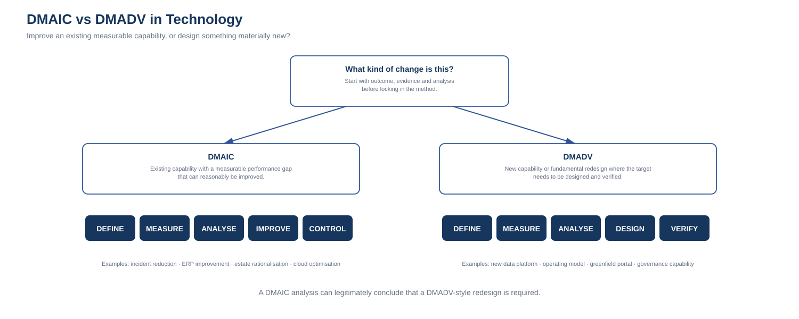

# 9. DMAIC vs DMADV in Technology

DMAIC and DMADV are related Six Sigma approaches, but they are intended for different kinds of change.

A useful technology distinction is:

> **DMAIC improves an existing capability. DMADV designs a materially new or fundamentally redesigned capability.**

This is a decision aid, not a rigid rule.

Some initiatives begin as DMAIC and discover during Analyse that incremental improvement is insufficient. They may then move into a design-led approach.

---

# DMAIC

**Define → Measure → Analyse → Improve → Control**

DMAIC is usually appropriate when:

- an existing process or capability exists;
- performance can be measured;
- there is a gap between current and desired performance;
- root causes can be investigated;
- the existing capability can reasonably be improved.

Technology examples:

- reduce service-desk resolution time;
- reduce failed changes;
- improve ERP order-processing performance;
- rationalise an application estate;
- reduce cloud waste;
- improve identity lifecycle controls;
- reduce recurring incidents;
- improve data quality in an existing flow.

The assumption is not that the existing solution must remain unchanged.

DMAIC can still lead to significant redesign.

The difference is that the work begins by understanding and improving a current-state capability.

---

# DMADV

**Define → Measure → Analyse → Design → Verify**

DMADV is more appropriate when:

- a capability does not yet exist;
- the current capability requires fundamental redesign rather than optimisation;
- a new product/service/process is being designed;
- requirements and critical outcomes need to be translated into a new design;
- the organisation needs to verify that the design performs before scale.

Technology examples:

- design a new enterprise data platform;
- establish a new technology operating model;
- create a greenfield customer portal;
- design a new AI governance capability;
- design a new enterprise integration architecture;
- establish a new service-management model following a major organisational change.

---

# The shared front end

Both approaches begin with similar disciplines.

## Define

Clarify business outcome, problem/opportunity, users/customers, scope, constraints and critical outcomes.

## Measure

Understand current performance where it exists, customer/user requirements, demand characteristics, risk, capacity and acceptance thresholds.

## Analyse

Determine causes, capability gaps, design requirements, trade-offs, dependencies and risks.

The paths then diverge.

---

# Improve vs Design

## Improve

Improve asks:

> What changes to the existing capability are most likely to address the analysed causes?

Potential interventions include process redesign, automation, configuration, consolidation, migration, standardisation and control improvements.

## Design

Design asks:

> What new capability should be created to meet the analysed requirements and outcomes?

Design may include architecture, service design, data model, process design, operating model, controls, integration, support model and user experience.

---

# Control vs Verify

## Control

Control asks:

> How will the improved state be sustained and how will drift be detected?

## Verify

Verify asks:

> Does the new design perform against the defined requirements under realistic conditions?

Verification may include:

- pilot;
- prototype;
- performance testing;
- user testing;
- security testing;
- operational-readiness testing;
- recovery testing;
- acceptance criteria.

After verification and production adoption, the new capability still requires operational control.

---

# Decision guide

## 1. Does a functioning capability already exist?

If no:
**DMADV is likely the stronger starting point.**

If yes:
continue.

## 2. Is the primary objective to improve measurable performance of that existing capability?

If yes:
**DMAIC is likely appropriate.**

If no:
continue.

## 3. Does the capability require fundamental redesign to meet the desired outcome?

If yes:
**DMADV may be more appropriate**, even though a current state exists.

## 4. Is the “new solution” already being assumed before analysis?

If yes:
return to **Define / Measure / Analyse** before choosing either path too firmly.

---

# Examples

## Existing service desk

Problem:
Average request fulfilment is too slow.

Current process exists and can be measured.

Use:
**DMAIC**

## New enterprise data platform

Problem:
The organisation lacks a governed enterprise capability for analytical data products.

There is no single current process to optimise into the target state.

Use:
**DMADV**

## Legacy integration estate

Problem:
Point-to-point integrations create fragility and slow change.

A current capability exists, but analysis may show that incremental optimisation cannot meet the future target.

Possible path:

**DMAIC**
to understand current failure, cost and root cause

then

**DMADV**
to design a materially different integration capability.

The methods can therefore be sequential rather than mutually exclusive.

---

# Relationship to technology roadmaps

### DMAIC-led roadmap
Often emphasises:

- stabilise;
- simplify;
- standardise;
- optimise;
- remove waste;
- strengthen controls.

### DMADV-led roadmap
Often emphasises:

- define target capability;
- design architecture;
- pilot;
- verify;
- migrate/adopt;
- scale.

A mixed technology roadmap may contain both.

The useful question is:

> **For this outcome, are we improving something that exists or designing something materially new?**
