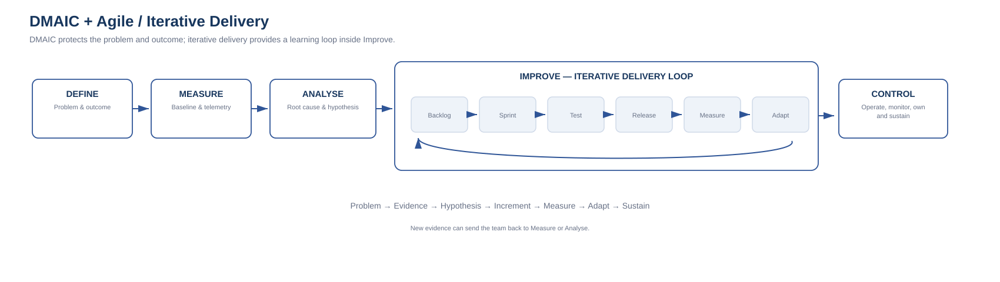

# 10. DMAIC and Agile / Iterative Delivery

DMAIC and Agile are often treated as if they belong to different eras or solve the same problem.

They do not.

A useful distinction is:

> **DMAIC structures the evidence and improvement problem. Agile structures iterative delivery and learning.**

The two can be complementary.

---

# The simple overlay

A practical model is:

**Define → Measure → Analyse → Improve [Backlog → Sprint → Test → Release → Measure → Adapt] → Control**

The Improve stage can contain iterative delivery.

That does not mean all discovery happens once before the first sprint.

The phases can be revisited as evidence changes.

The important point is that iterative delivery remains connected to:

- a defined problem;
- an understood baseline;
- a reasoned hypothesis;
- measurable outcomes.

---

# DEFINE and Agile

Agile teams still need clarity about the problem.

Useful Define inputs can become:

- product goal;
- problem statement;
- user/customer outcomes;
- stakeholders;
- scope boundaries;
- critical measures;
- constraints.

The DMAIC lens helps avoid a backlog becoming the de facto strategy.

A backlog is a delivery artefact.

It is not, by itself, evidence that the right problem is being solved.

---

# MEASURE and Agile

Agile delivery becomes stronger when the team knows how the current state performs.

Useful measures may include:

- user task completion;
- cycle time;
- error rate;
- service performance;
- adoption;
- conversion;
- manual effort;
- incident rate;
- cost.

Without a baseline, a release can demonstrate activity without demonstrating improvement.

---

# ANALYSE and Agile

Analyse should not become months of documentation before delivery.

It can be proportionate and iterative.

Possible activities:

- user research;
- process mapping;
- data analysis;
- root-cause analysis;
- technical spikes;
- dependency analysis;
- architecture assessment;
- prototype discovery.

The goal is enough understanding to avoid treating every visible symptom as a product requirement.

---

# IMPROVE as an iterative loop

This is where Agile is most obviously complementary.

An Improve loop might be:

1. Select a high-confidence improvement hypothesis.
2. Translate it into backlog items.
3. Build a small increment.
4. Test technically and with users.
5. Release or pilot.
6. Measure the relevant outcome.
7. Adapt the backlog based on evidence.
8. Repeat.

This can support MVPs, pilots, progressive rollout, feature flags, staged migration and controlled experimentation.

The key is that “done” includes learning about whether the change improved the measure.

---

# CONTROL after iterative delivery

Continuous delivery does not remove the need for Control.

In fact, high delivery frequency makes explicit control more important.

Control can include:

- telemetry;
- SLOs / SLIs where appropriate;
- operational ownership;
- automated tests;
- deployment guardrails;
- change-failure monitoring;
- feature adoption metrics;
- error budgets;
- security monitoring;
- cost monitoring;
- benefits measures.

Control should be designed into the product/service rather than added only at project close.

---

# Example: customer onboarding

Problem:
Customer onboarding takes ten days and creates significant manual follow-up.

## Define
Reduce end-to-end onboarding time while preserving compliance and customer experience.

## Measure
Baseline:

- ten-day average;
- six major hand-offs;
- 18% of cases require data correction;
- approval queue contributes significant elapsed time.

## Analyse
Causes include:

- duplicate data entry;
- unclear approval rules;
- manual verification;
- integration gaps.

## Improve — Agile delivery

### Increment 1
Pre-populate known customer data.

Measure:
re-entry and correction rate.

### Increment 2
Automate low-risk verification.

Measure:
manual touch time and queue time.

### Increment 3
Introduce exception-based approval.

Measure:
approval cycle time and compliance exceptions.

Each increment is assessed against the original outcome, not just completion.

## Control
Monitor:

- onboarding time;
- correction rate;
- exception rate;
- automation rate;
- customer feedback.

---

# Agile does not mean every problem needs a product backlog

Some improvements may be:

- commercial;
- governance;
- organisational;
- architecture;
- process;
- policy;
- vendor-management;
- operational.

DMAIC can reveal that the best improvement is not software.

---

# DMAIC also does not mean large upfront analysis

The opposite mistake is turning Define, Measure and Analyse into a sequential stage-gate process that delays learning.

A proportionate approach might be:

**Initial Define → minimum useful baseline → initial analysis → first improvement experiment → measure → refine analysis**

The evidence chain remains intact even when the process is iterative.

---

# Portfolio and program implications

At program level, iterative projects can still contribute to one program outcome.

The program should ask:

> Are all of these increments collectively changing the target outcome?

At portfolio level, evidence from iterative delivery can support:

- continue;
- scale;
- pivot;
- defer;
- stop.

This creates a useful link between Agile delivery and portfolio governance.

---

# Practical working principle

For technology delivery:

**DMAIC protects the problem and outcome.**  
**Agile protects learning and delivery flow.**  
**Operations protects sustainability.**

Used together, they can create a stronger chain:

**Problem → Evidence → Hypothesis → Increment → Measure → Adapt → Sustain**
