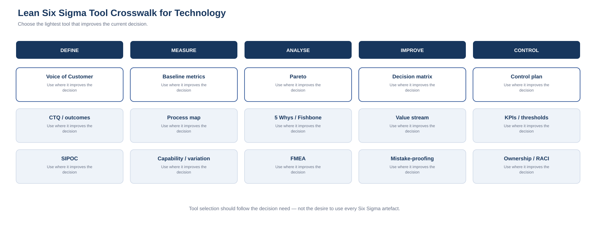

# 11. Six Sigma / Lean Tool Crosswalk for Technology

Lean Six Sigma contains many tools. Technology teams do not need to use all of them. The useful question is:

> **Which tool improves the current decision with better evidence?**

| Tool | Technology use | Typical level |
|---|---|---|
| Voice of Customer | Understand business/user outcomes, pain points and priorities | Strategy / Program / Product |
| CTQ / Critical-to-Outcome | Convert needs into measurable success criteria | Strategy / Program / Project |
| SIPOC | Define process boundaries, suppliers, inputs, outputs and customers | Process / Integration / Service |
| Process Map | Visualise current and target workflows | Project / Operations |
| Value Stream Map | Separate touch time from waiting and hand-offs | Program / Operations |
| Pareto | Focus on the small number of causes creating most impact | Portfolio / Operations |
| 5 Whys | Explore recurring or systemic causes | Project / Operations |
| Fishbone | Structure multi-factor cause analysis | Program / Project |
| FMEA | Identify and prioritise failure modes | Program / Project / Operations |
| Cost of Poor Quality | Quantify rework, downtime, inefficiency and failure cost | Strategy / Portfolio |
| Control Plan | Define how an improved state is sustained | Project / Operations |
| Poka-Yoke / mistake-proofing | Prevent predictable errors through validation and automation | Engineering / Operations |
| Capability / variation analysis | Assess whether service/process performance is stable and fit for purpose | Operations |
| Decision matrix | Compare options using explicit criteria | Strategy / Portfolio |
| RACI / decision rights | Clarify accountability and escalation | Strategy / Program / Operations |

## Voice of Customer

Technology strategy can become internally focused. Voice of Customer can include business interviews, user research, service feedback, complaints, support data, customer analytics and product usage.

The objective is to understand the outcome before designing the solution.

A request for a new CRM may actually represent a need for a reliable customer view, faster sales follow-up and better service history.

## CTQ / Critical-to-Outcome

Broad expectations need to become measurable.

“Improve resilience” might become:

- recovery within agreed RTO;
- recovery point within agreed RPO;
- successful restore testing;
- reduced single points of failure;
- defined service ownership.

For executive technology work, **Critical-to-Outcome** can be more intuitive than traditional manufacturing language.

## SIPOC

SIPOC is useful when process or technology-flow boundaries are unclear.

For employee onboarding:

- **Suppliers:** HR, hiring manager, identity source
- **Inputs:** employee data, role, start date, approval
- **Process:** create identity → provision access → issue device → validate access
- **Outputs:** ready user, access evidence, device allocation
- **Customers:** employee, manager, security, support

It is particularly useful for integrations, identity lifecycle, data pipelines, onboarding/offboarding and vendor hand-offs.

## Pareto

Technology examples include:

- incident categories;
- applications by support effort;
- vendors by spend;
- systems by lifecycle risk;
- causes of project delay;
- security findings by exposure;
- automation candidates by manual effort.

The point is not that an exact 80/20 rule must exist. It is to avoid spreading effort equally across problems with very different impact.

## 5 Whys and Fishbone

These help when a visible symptom has several possible causes.

Example: deployment delays may be caused by people, process, platform, data, vendor, governance, environment or dependency issues. The analysis may reveal that approval timing or environment readiness matters more than release tooling.

## FMEA

Failure Modes and Effects Analysis is useful where change or operations contain several possible failure paths.

Technology applications include:

- production cutover;
- migration;
- identity change;
- disaster recovery;
- integration redesign;
- cybersecurity controls;
- AI adoption;
- vendor transition.

## Cost of Poor Quality

Technology waste is often spread across budgets:

- recurring incidents;
- failed changes;
- rework;
- licence waste;
- contractor effort;
- manual reconciliation;
- duplicated systems;
- downtime.

This concept is powerful at portfolio level because it gives improvement work an economic context.

## Control Plan

A control plan typically states:

- measure;
- owner;
- frequency;
- threshold;
- evidence source;
- response;
- escalation.

Technology examples include application ownership, licence utilisation, patch compliance, backup verification, service availability, vendor performance and benefits tracking.

## Mistake-proofing

In technology this can mean:

- input validation;
- policy-as-code;
- automated guardrails;
- secure defaults;
- deployment checks;
- access workflow rules;
- pre-flight validation.

The goal is not to eliminate judgement. It is to prevent predictable error where judgement adds little value.

## Tool-selection principle

**Define:** tools that clarify the problem and outcome.  
**Measure:** tools that establish the baseline.  
**Analyse:** tools that expose cause, concentration, risk and dependency.  
**Improve:** tools that compare options and test interventions.  
**Control:** tools that sustain the outcome and detect drift.

Use the lightest toolset that creates enough evidence for the decision.
