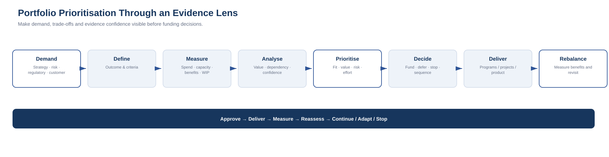

# 12. Portfolio Prioritisation Through a Lean Six Sigma Lens

Portfolio management is where strategy meets scarcity.

There are always more ideas, obligations and improvement opportunities than there is money, capacity or organisational attention.

The portfolio question is not:

> Which projects are good?

It is:

> **Which combination of investments creates the strongest outcome within our constraints?**

## 1. Start with demand

Portfolio demand can come from strategy, regulatory obligations, cyber risk, technical debt, customer needs, cost reduction, vendor lifecycle, operational pain, growth, innovation or acquisitions.

Useful classifications include:

- mandatory;
- strategic;
- risk reduction;
- optimisation;
- exploratory.

## 2. Define decision criteria

A practical set of criteria can include:

- strategic alignment;
- measurable value;
- risk reduction;
- customer impact;
- regulatory necessity;
- dependency enablement;
- time criticality;
- cost;
- effort;
- capacity;
- reversibility;
- confidence in evidence.

Weights can vary. The point is to make trade-offs visible, not to create false precision.

## 3. Measure the portfolio

Useful measures include:

- total committed spend;
- capacity by team/capability;
- discretionary vs mandatory spend;
- initiatives by strategic theme;
- forecast vs actual;
- benefits realised;
- work in progress;
- ageing initiatives;
- dependency concentration;
- vendor concentration.

## 4. Analyse imbalance

Ask:

- Are too many initiatives addressing the same capability?
- Are critical dependencies overloaded?
- Is mandatory work crowding out strategic investment?
- Are projects continuing despite weak benefit evidence?
- Is the organisation starting more work than it can absorb?
- Are the same scarce specialists required across multiple programs?

## 5. Prioritise explicitly

A simple 1–5 model might use:

| Criterion | Example weight |
|---|---:|
| Strategic alignment | 20% |
| Business value | 20% |
| Risk reduction | 15% |
| Dependency enablement | 15% |
| Customer / user impact | 10% |
| Time criticality | 10% |
| Delivery confidence | 10% |

Cost and effort can be treated as constraints or included in scoring.

## 6. Use evidence confidence

Two initiatives can appear equally valuable while having very different evidence quality.

Use:

- High confidence
- Medium confidence
- Low confidence

Low confidence does not automatically mean “do not fund”. It may mean **fund discovery, pilot or proof-of-value before committing the full investment**.

## 7. Fund, defer, stop, sequence

Possible decisions include:

- fund;
- conditionally fund;
- fund discovery only;
- defer;
- sequence behind dependency;
- reduce scope;
- merge;
- stop;
- retire.

The portfolio should be able to stop work when evidence changes.

## 8. Control the portfolio

The portfolio should revisit:

- benefit delivery;
- assumptions;
- capacity;
- dependencies;
- risk;
- cost;
- strategic fit.

This creates:

**Approve → Deliver → Measure → Reassess → Continue / Adapt / Stop**

## Common anti-patterns

**Project list as strategy** — funded projects are not automatically a technology strategy.

**Highest-paid-person prioritisation** — judgement matters, but visible assumptions improve judgement.

**Scoring theatre** — a weighted spreadsheet should support discussion, not replace it.

**Permanent green** — delivery can be green while benefit evidence deteriorates.

**Too much WIP** — starting everything can delay everything.

The practical flow is:

**Demand → Define → Baseline → Analyse → Prioritise → Fund/Defer/Stop → Deliver → Measure Benefits → Rebalance**
