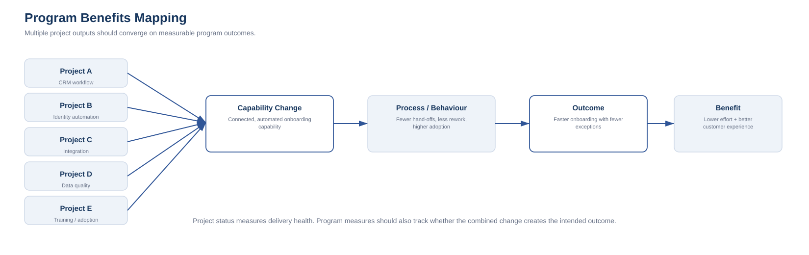

# 13. Program Benefits Mapping

A program exists because the intended outcome requires coordinated change across multiple initiatives.

> **Project outputs are not the same as program outcomes.**

A useful benefits chain is:

**Project Output → Capability Change → Behaviour / Process Change → Outcome → Benefit**

Example:

- **Project output:** digital identity workflow deployed
- **Capability change:** low-risk verification can occur automatically
- **Behaviour/process change:** fewer cases require manual review
- **Outcome:** onboarding cycle time falls
- **Benefit:** lower operating effort and improved customer experience

The project delivered the workflow. The program is accountable for whether that workflow contributes to the intended business outcome.

## Multiple projects, one outcome

A customer-onboarding program might contain:

- CRM workflow redesign;
- identity verification;
- integration;
- data-quality uplift;
- customer portal;
- training.

Each project can report scope, schedule, budget, risks and milestones.

The program should additionally measure:

- onboarding time;
- abandonment;
- rework;
- exception rate;
- manual effort;
- customer satisfaction;
- conversion.

The program-level question is:

> Are the combined changes improving onboarding?

## Benefits dependency mapping

Benefits often require multiple changes to happen together.

A CRM alone may not reduce onboarding time. The benefit may also require integration, training, changed approval rules, automated identity checks and retirement of the old process.

A benefits dependency map makes this visible.

## Define benefit hypotheses

A benefit should include baseline, target, owner, measurement method, timing, dependencies and assumptions.

| Benefit | Baseline | Target | Owner | Dependency |
|---|---:|---:|---|---|
| Onboarding cycle time | 10 days | 3 days | Operations | CRM + identity + process redesign |
| Manual review rate | 42% | 15% | Operations | identity automation |
| Data correction rate | 18% | 5% | Data owner | validation + data-quality uplift |

## Benefits can lag delivery

Project completion may precede the benefit because of adoption, training, migration, contract cycles, customer behaviour or decommissioning.

Program governance should distinguish:

- output complete;
- capability available;
- adoption achieved;
- benefit realised.

## Benefits can conflict

One measure can improve while another worsens. Stricter controls may reduce risk but increase cycle time.

The program should define the intended balance and avoid optimising one metric at the expense of the whole system.

## Program control

Useful controls include:

- benefits register;
- dependency map;
- adoption measures;
- outcome dashboard;
- business-owner review;
- operational readiness;
- benefit variance analysis.

A program should be able to answer:

1. What outcomes were expected?
2. Which projects were supposed to enable them?
3. Which capabilities now exist?
4. Are users/processes adopting them?
5. Are the measures moving?
6. If not, which assumption failed?

> **Five green projects do not guarantee a successful program.**
