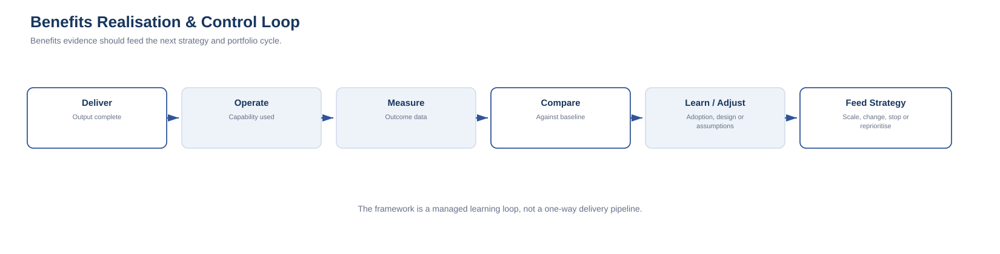

# 14. Benefits Realisation and the Control Loop

Benefits realisation closes the framework.

Without it, the lifecycle ends at delivery. With it, the organisation compares the achieved state with the original baseline and feeds the learning into the next strategy and portfolio cycle.

The loop is:

**Deliver → Operate → Measure → Compare to Baseline → Learn / Adjust → Feed Strategy & Portfolio**

## Define the benefit before delivery

A benefit should state:

- outcome;
- baseline;
- target;
- owner;
- measurement source;
- timing;
- assumptions;
- dependencies.

Weak:

> Improve efficiency.

Stronger:

> Reduce average manual handling time from 18 minutes to below 10 minutes within six months of full adoption.

## Separate output, outcome and benefit

**Output:** something delivered.  
Example: new workflow deployed.

**Outcome:** measurable operational change.  
Example: fewer manual hand-offs.

**Benefit:** value created by that outcome.  
Example: lower labour effort and faster customer response.

This distinction prevents delivery completion from being mistaken for value realisation.

## Measure against the baseline

Ask:

- What was the original state?
- Has the measure moved?
- Is the change operationally meaningful?
- Was the expected benefit attributed correctly?
- Did another factor create the change?

Not every improvement requires advanced statistics, but every material benefit should have a credible measurement method.

## Understand benefit variance

If the target is missed, possible causes include:

- adoption lower than expected;
- wrong root cause;
- implementation issue;
- changed business conditions;
- optimistic assumption;
- process not changed;
- legacy system retained;
- dependency delayed;
- measurement problem.

Variance should trigger analysis, not blame.

## Control the improved state

Controls can include:

- KPI dashboards;
- service ownership;
- architecture governance;
- licence review;
- policy-as-code;
- automated tests;
- exception reporting;
- vendor scorecards;
- financial tracking;
- benefit-owner accountability.

## Feed learning back to strategy

If benefits exceed expectations:
- scale;
- replicate;
- reprioritise.

If benefits underperform:
- investigate;
- remediate;
- change assumptions;
- stop further investment if needed.

If the environment changes:
- revise the target state.

## Review cadence

A practical cadence may include:

- **30 days:** service stability and immediate adoption
- **90 days:** early outcome movement and benefit confidence
- **6 months:** benefit trajectory and operational sustainability
- **12 months:** full benefit review and strategic learning

Use only the checkpoints appropriate to the benefit.

## Benefit ownership

Technology can own delivery without owning the business benefit.

For example, IT may own a workflow platform while Operations owns cycle-time reduction and Finance validates savings.

## Complete closed loop

The full model becomes:

**Business Need → Strategy → Roadmap → Portfolio → Program → Project → Operations → Benefits → Learning → Strategy**

DMAIC remains the horizontal evidence discipline:

**Define → Measure → Analyse → Improve → Control**

The framework is therefore a managed learning loop, not a one-way delivery pipeline.
